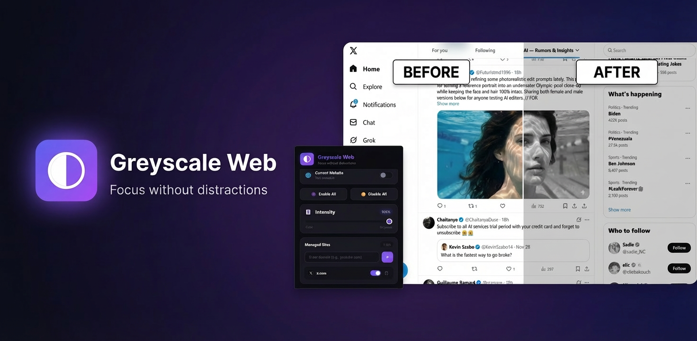
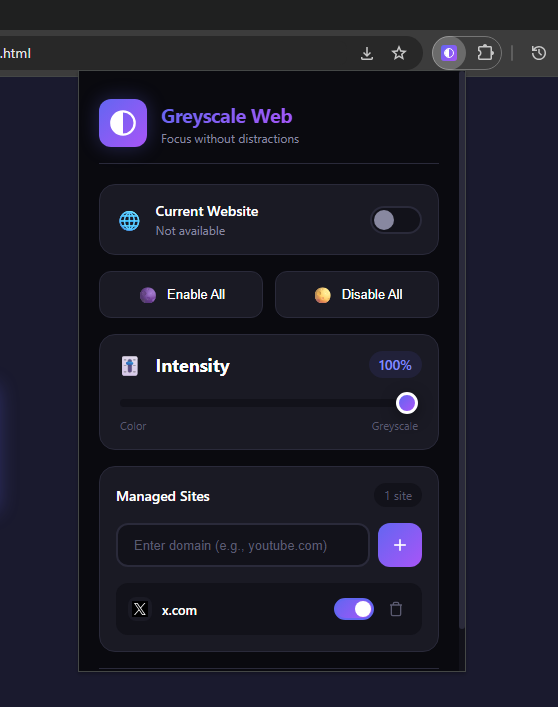
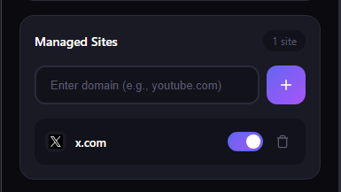
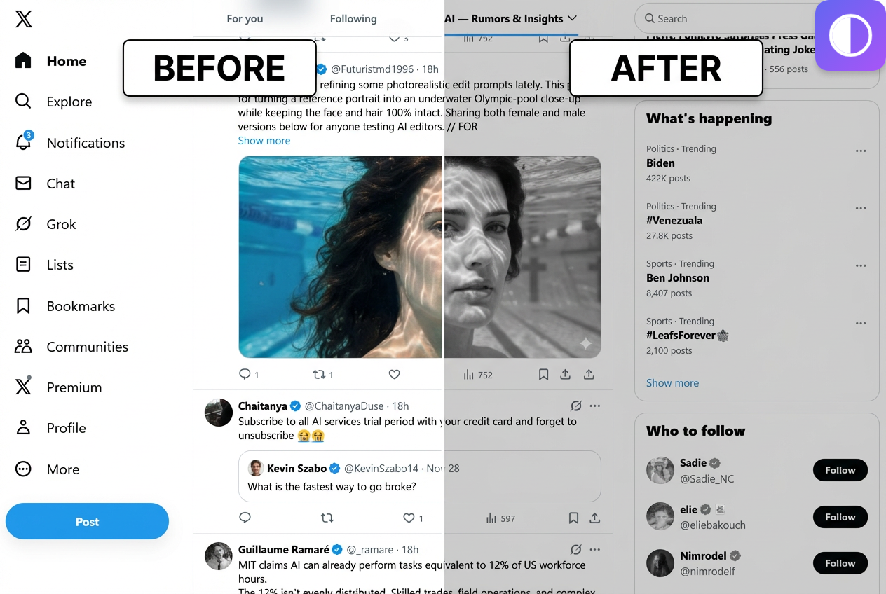
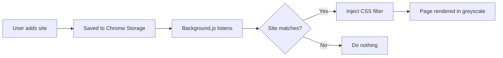

<div align="center">
  
# 🌑 Greyscale Web

### Transform any website to greyscale for focused, distraction-free browsing

[](https://chrome.google.com)
[](https://developer.chrome.com/docs/extensions/mv3/)
[](LICENSE)
[](CONTRIBUTING.md)

<br>



<br>

**[Features](#-features) • [Installation](#-installation) • [Usage](#-usage) • [Contributing](#-contributing)**

</div>

---

## ✨ Features

<table>
<tr>
<td width="50%">

### 🎯 **Focused Browsing**
Remove colorful distractions from any website. Perfect for reducing time spent on social media and entertainment sites.

### ⚡ **Lightweight & Fast**
Optimized performance with no impact on browsing speed. Only activates on sites you specify.

### 🎚️ **Adjustable Intensity**
Fine-tune the greyscale level from 0% to 100% to find your perfect balance.

</td>
<td width="50%">

### 🔄 **Instant Toggle**
One-click enable/disable for the current website. Changes apply immediately without refresh.

### 📋 **Site Management**
Easily add, remove, and manage multiple websites. All settings sync across your devices.

### 🌙 **Beautiful Dark UI**
Modern, elegant interface that's easy on the eyes with smooth animations.

</td>
</tr>
</table>

---

## 📸 Screenshots

<div align="center">
<table>
<tr>
<td align="center">

<br>
<sub><b>Main Interface</b></sub>
</td>
<td align="center">

<br>
<sub><b>Site Management</b></sub>
</td>
<td align="center">

<br>
<sub><b>Before & After</b></sub>
</td>
</tr>
</table>
</div>

---

## 🚀 Installation

### From Source (Developer Mode)

1. **Clone the repository**
   ```bash
   git clone https://github.com/yourusername/greyscale-web.git
   cd greyscale-web
   ```

2. **Open Chrome Extensions**
   ```
   Navigate to chrome://extensions/
   ```

3. **Enable Developer Mode**
   
   Toggle the "Developer mode" switch in the top right corner

4. **Load the Extension**
   
   Click "Load unpacked" and select the `greyscale-web` folder

5. **Pin the Extension**
   
   Click the puzzle icon in Chrome toolbar and pin Greyscale Web for easy access

### From Chrome Web Store

> 🚧 Coming Soon!

---

## 📖 Usage

### Quick Start

1. **Click** the Greyscale Web icon in your toolbar
2. **Toggle** the switch for the current website
3. **Adjust** the intensity slider to your preference
4. **Browse** without colorful distractions!

### Managing Sites

| Action | How To |
|--------|--------|
| **Add a site** | Type domain in the input field and click ➕ or press Enter |
| **Remove a site** | Click the 🗑️ trash icon next to the site |
| **Toggle a site** | Use the switch next to each site name |
| **Enable/Disable all** | Use the quick action buttons at the top |

### Keyboard Shortcuts

| Shortcut | Action |
|----------|--------|
| `Enter` | Add typed domain to list |
| `Escape` | Close popup |

---

## 🏗️ Project Structure

```
greyscale-web/
├── 📄 manifest.json      # Extension configuration
├── 📄 popup.html         # Popup interface
├── 🎨 popup.css          # Styles for popup
├── ⚙️ popup.js           # Popup functionality
├── 🔧 background.js      # Service worker (handles injection)
├── 📁 icons/
│   ├── icon16.png        # Toolbar icon
│   ├── icon48.png        # Extension management icon
│   └── icon128.png       # Chrome Web Store icon
└── 📁 screenshots/       # Repository screenshots
```

---

## 🔧 How It Works



1. **User Management**: Sites are managed through the popup interface
2. **Sync Storage**: Settings sync across all Chrome browsers where you're signed in
3. **Smart Injection**: CSS is only injected on matching domains (performance optimized)
4. **Real-time Updates**: Changes apply instantly without page refresh

---

## 🛠️ Development

### Prerequisites

- Google Chrome or Chromium-based browser
- Basic knowledge of HTML, CSS, JavaScript

### Local Development

```bash
# Clone the repo
git clone https://github.com/yourusername/greyscale-web.git

# Navigate to directory
cd greyscale-web

# Load in Chrome (see installation steps above)
# Make changes to files
# Click "Reload" in chrome://extensions/ to see changes
```

### Building Icons

Open `icon-generator.html` in Chrome and download the generated icons.

---

## 🤝 Contributing

Contributions are welcome! Here's how you can help:

1. **Fork** the repository
2. **Create** a feature branch
   ```bash
   git checkout -b feature/amazing-feature
   ```
3. **Commit** your changes
   ```bash
   git commit -m "Add amazing feature"
   ```
4. **Push** to the branch
   ```bash
   git push origin feature/amazing-feature
   ```
5. **Open** a Pull Request

### Ideas for Contribution

- [ ] Scheduled greyscale (time-based activation)
- [ ] Keyboard shortcut to toggle current site
- [ ] Whitelist mode (greyscale everything except listed sites)
- [ ] Per-site intensity settings
- [ ] Firefox/Edge port
- [ ] Localization/translations

---

## 📊 Performance

This extension is optimized for minimal performance impact:

| Metric | Value |
|--------|-------|
| **Memory Usage** | ~10-20 MB |
| **CPU Impact** | Negligible |
| **Load Time Impact** | None on non-listed sites |
| **Background Activity** | Event-driven only |

---

## ❓ FAQ

<details>
<summary><b>Does this slow down my browsing?</b></summary>
<br>
No! The extension only activates on sites you've specifically added. Other websites are completely unaffected.
</details>

<details>
<summary><b>Do my settings sync between computers?</b></summary>
<br>
Yes! All settings are stored in Chrome Sync storage, so they follow your Google account.
</details>

<details>
<summary><b>Can I use this on Firefox?</b></summary>
<br>
Not yet, but a Firefox port is planned. Contributions welcome!
</details>

<details>
<summary><b>Why would I want greyscale websites?</b></summary>
<br>
Color is a powerful attention-grabber. Social media and entertainment sites use vibrant colors to keep you engaged. Greyscale removes this stimulus, making sites less appealing and helping reduce mindless scrolling.
</details>

<details>
<summary><b>Does it work on YouTube videos?</b></summary>
<br>
Yes, the entire page including videos will be greyscale. This is intentional to reduce the appeal of watching videos.
</details>

---

## 📜 License

This project is licensed under the MIT License - see the [LICENSE](LICENSE) file for details.

---

## 🙏 Acknowledgments

- Inspired by digital wellbeing and focus tools
- Built with modern Chrome Extension Manifest V3
- Icons generated with HTML5 Canvas

---

<div align="center">

### Made with 🖤 for focused browsing

**[⬆ Back to Top](#-greyscale-web)**

<br>

[](https://github.com/yourusername/greyscale-web/stargazers)
[](https://github.com/yourusername/greyscale-web/network/members)

</div>
